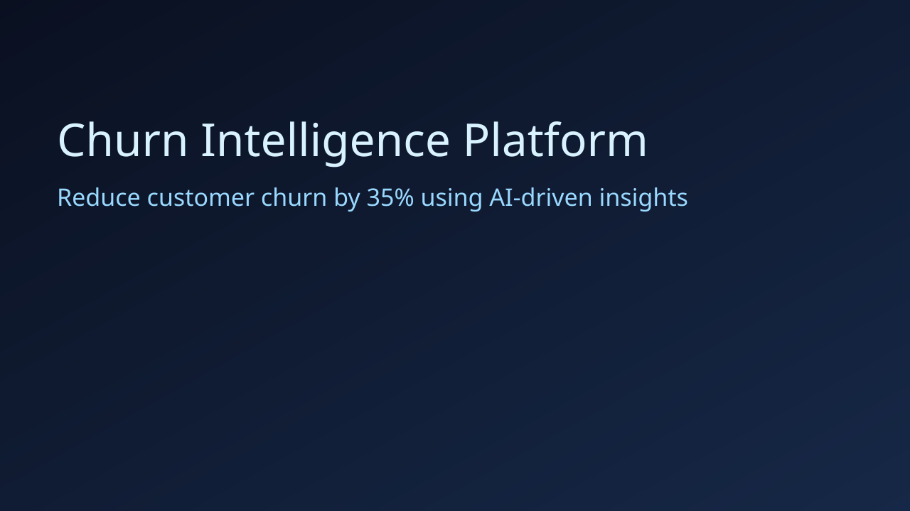
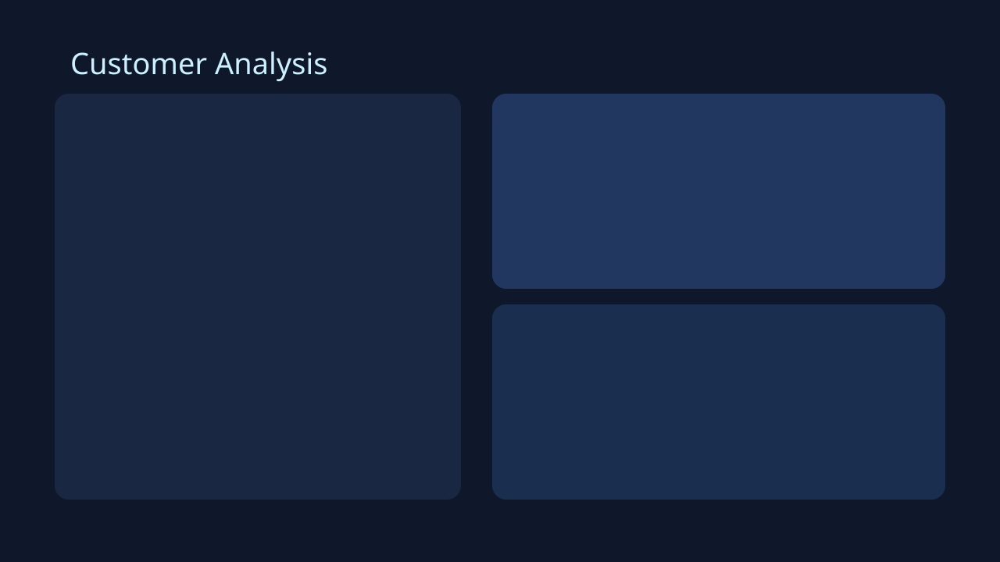

# RetainIQ

Predict churn. Understand why. Take action.

A frontend-only, beginner-friendly SaaS-style React app for checking churn risk, explaining results, and viewing revenue impact.

## Product highlights

- Frontend-only React app built with Vite, TypeScript, Tailwind, Framer Motion, and Recharts.
- Simple beginner-friendly navigation and explanations.
- Churn scoring simulated in-browser for easy local checking and Vercel deployment.
- Revenue impact dashboard with top customers to save.
- Clean light theme with clear labels and soft visuals.

## Architecture

```
ML_Project/
  frontend/                 # Standalone React app for Vercel
  backend/                  # Optional backend code kept for reference
  ml/                       # Optional ML code kept for reference
  artifacts/                # Optional model and analytics artifacts
  tests/                    # Optional Pytest suite
```

## Screenshots





## Setup

### 1) Run frontend locally

```powershell
cd frontend
npm install
npm run dev
```

Open app: http://127.0.0.1:5173

### 2) Build for Vercel

```powershell
cd frontend
npm run build
```

### 3) Run tests

```powershell
pytest -q
```

## Dashboard modules

- Landing page with SaaS-style hero and CTA.
- Overview with KPI cards for users, churn, and revenue at risk.
- Customer analysis panel with live churn scoring and SHAP-style explanation.
- Segmentation table with filtering and sorting.
- Revenue dashboard showing top customers to retain and retained revenue.
- What-if simulator for live scenario testing.
- Insights panel with business-ready churn recommendations.

## Deploy

- Frontend: Vercel (root = `frontend/`, build command `npm run build`, output = `dist`)
- Backend is optional and not required for deployment.

## Validation

- Frontend production build: passed.

## Resume-ready bullets

- Built a full-stack churn intelligence SaaS platform with React, FastAPI, and scikit-learn, delivering real-time churn scoring and business recommendations.
- Trained and compared Logistic Regression, Random Forest, and XGBoost using cross-validation and production metrics (ROC-AUC, F1, Precision, Recall).
- Implemented SHAP explainability to expose per-customer churn drivers and improve trust in model predictions for stakeholders.

